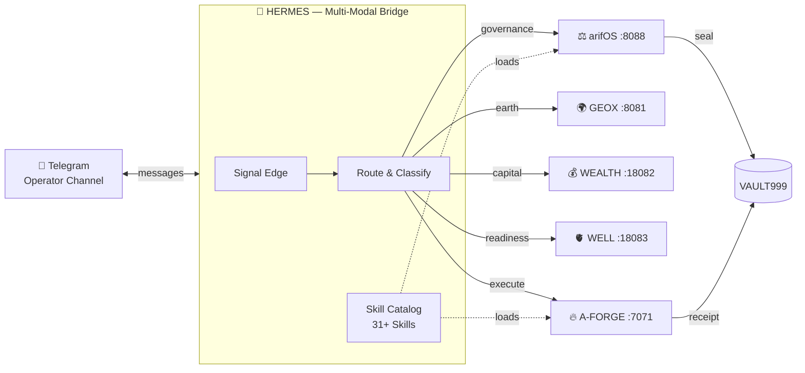

<!-- SOT-MANIFEST
federation_release: v2026.07.24
last_verified: 2026-07-24T08:00Z
live_commit: fa890a2
organ: HERMES
role: multi-modal-bridge (organ 7 of 7)
authority: OBSERVE_ONLY — routes and bridges, never adjudicates
truth_rule: tools/list + /health beat any static count in prose
-->

# 🔮 HERMES — Multi-Modal Bridge

[](https://github.com/ariffazil/HERMES/actions/workflows/domain-ci.yml)
[](https://arifos.arif-fazil.com)
[](LICENSE)

> **HERMES routes. It never adjudicates.**
> **DITEMPA BUKAN DIBERI — Forged, Not Given.**
> **Organ 7 of 7 — arifOS Federation**

---

## TL;DR

HERMES is the **multi-modal bridge** of the arifOS Federation. It routes signals between organs — Telegram ↔ arifOS ↔ agents — and manages the federation's skill catalog (31 arif-specific skills).

---

## 1. Role

| ✅ DOES | ❌ NEVER |
|---------|---------|
| Telegram operator edge | Adjudicates (→ arifOS) |
| Creative/media surface routing | Executes mutations (→ A-FORGE) |
| Visual/audio signal ingestion | Diagnoses (→ WELL) |
| Multi-modal evidence routing | Self-authorizes |
| Skill catalog management | Issues verdicts |

---

## 2. Federation Position

```
Arif (F13 SOVEREIGN)
    ↓
AAA / HERMES / OpenClaw (A2A edge)
    ↓
arifOS (:8088) — judges, seals, routes
    ↓
Domain Organs (GEOX :8081 · WEALTH :18082 · WELL :18083)
    ↓
A-FORGE (:7071) — executes after SEAL
    ↓
VAULT999 — immutable record
```

HERMES sits at the **edge** — it bridges external signals into the federation and routes creative/media evidence to the reasoning layer.



---

## 3. Federation Cross-Reference

| Organ | Role | Port | Repo |
|-------|------|------|------|
| arifOS | Constitutional kernel | 8088 | [ariffazil/arifos](https://github.com/ariffazil/arifos) |
| AAA | State + cockpit | 3001 | [ariffazil/AAA](https://github.com/ariffazil/AAA) |
| A-FORGE | Execution shell | 7071/7072 | [ariffazil/A-FORGE](https://github.com/ariffazil/A-FORGE) |
| GEOX | Earth intelligence | 8081 | [ariffazil/geox](https://github.com/ariffazil/geox) |
| WEALTH | Capital intelligence | 18082 | [ariffazil/wealth](https://github.com/ariffazil/wealth) |
| WELL | Vitality guard | 18083 | [ariffazil/well](https://github.com/ariffazil/well) |
| **HERMES** | Multi-modal bridge | 8644 | ← you are here |

---

## 4. Quick Start

```bash
cd /root/HERMES
# Health: probed via federation health check
# Git remote: git@github.com:ariffazil/HERMES.git
```

---

## 5. License & Sovereignty

**AGPL-3.0.** HERMES routes under sovereign authority. It never adjudicates.

**Muhammad Arif bin Fazil** is F13 SOVEREIGN. His word is final.

```
HERMES · Port 8644 · BRIDGE_LAW · Organ 7 of 7
Routes, never adjudicates. DITEMPA BUKAN DIBERI.
```

---

## Federation Separation of Powers

| Layer | Role | Can | Cannot |
|-------|------|-----|--------|
| **ARIF** | Sovereign | Veto, approve, decide | Be overridden |
| **AAA** | State / Cockpit | Display, route, queue, register | Judge, execute, seal |
| **arifOS** | Judge | Issue SEAL/HOLD/VOID/SABAR | Execute mutations |
| **Domain Organs** | Witnesses | Compute and reflect evidence | Decide alone |
| **A-FORGE** | Executor | Build, deploy, mutate | Self-authorize |
| **HERMES** | Edge Bridge | Route signals, manage skills | Adjudicate |
| **VAULT999** | Ledger | Record immutable seals | Edit or delete history |

> AAA routes and displays. arifOS judges. Domain organs witness. A-FORGE executes. HERMES bridges. VAULT999 records. ARIF decides.

> **SOT:** 2026-07-24 | **seal_seq:** `fa890a2`
