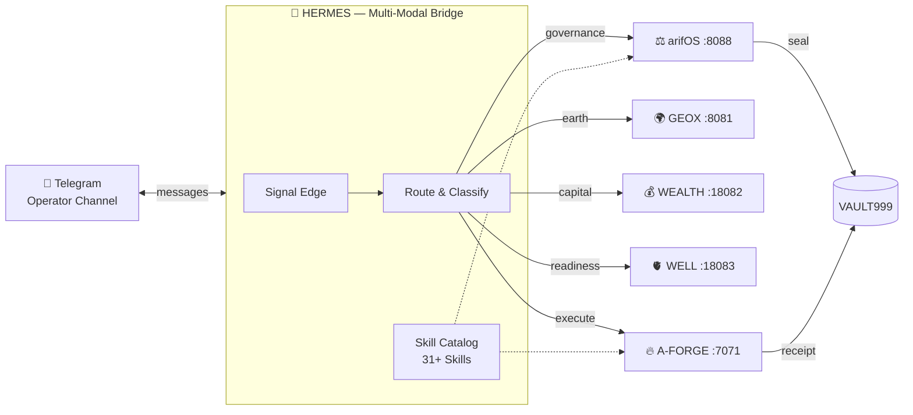

<!-- SOT-MANIFEST
federation_release: v2026.08.04
last_verified: 2026-08-04T20:23:33Z
live_commit: cea953c (FEDERATION.md restoration + 15 new skills + skill patches)
organ: HERMES
role: multi-modal-bridge (organ 7 of 8)
authority: OBSERVE_ONLY — routes and bridges, never adjudicates
truth_rule: tools/list + /health beat any static count in prose
-->

# 🔮 HERMES — Multi-Modal Bridge & Telegram Relay

[](https://github.com/ariffazil/HERMES/actions/workflows/domain-ci.yml)
[](https://arifos.arif-fazil.com)
[](./LICENSE)

> **HERMES routes. It never adjudicates.**
> **DITEMPA BUKAN DIBERI — Forged, Not Given.**

**HERMES** is the multi-modal bridge organ of the arifOS Federation. It routes signals between the outside world and the federation — Telegram ↔ arifOS ↔ agents — and manages the federation's skill catalog. It sits at the edge, bridging external signals into the constitutional governance layer.

---

## 🔮 Role

| ✅ DOES | ❌ NEVER |
|---------|---------|
| Telegram operator edge | Adjudicates (→ arifOS) |
| Creative & media surface routing | Executes mutations (→ A-FORGE) |
| Visual, audio, & document ingestion | Diagnoses (→ WELL) |
| Multi-modal evidence routing | Self-authorizes |
| Skill catalog management (31+ skills) | Issues verdicts |

---

## 🧭 Federation Position


```mermaid
graph LR
    TG[📱 Telegram<br/>Operator Channel] <-->|messages| HERMES
    subgraph HERMES [🔮 HERMES — Multi-Modal Bridge]
        EDGE[Signal Edge] --> ROUTE[Route & Classify]
        SKILL[Skill Catalog<br/>31+ Skills]
    end
    ROUTE -->|governance| ARIFOS[⚖️ arifOS :8088]
    ROUTE -->|earth| GEOX[🌍 GEOX :8081]
    ROUTE -->|capital| WEALTH[💰 WEALTH :18082]
    ROUTE -->|readiness| WELL[🫀 WELL :18083]
    ROUTE -->|execute| AFORGE[🔥 A-FORGE :7071]
    ARIFOS -->|seal| VAULT[(VAULT999)]
    AFORGE -->|receipt| VAULT
    SKILL -.-> ARIFOS
    SKILL -.-> AFORGE
```

---

## ⚡ Operations

```bash
cd /root/HERMES
# Health: probed via federation health check
# Git remote: git@github.com:ariffazil/HERMES.git
# Port: 8644 (bridge) · 18901 (FLAME free inference lane)
```

---

## 🏛️ Federation Navigation

| Organ | Role | Port | Repo | MCP | Health | LLMs |
|:---|:---|:---:|:---|:---|:---|:---|
| **⚖️ arifOS** | Constitutional Kernel — judges, seals | 8088 | [repo](https://github.com/ariffazil/arifos) | [mcp](https://mcp.arif-fazil.com/mcp) | [health](https://arifos.arif-fazil.com/health) | [llms.txt](https://arifos.arif-fazil.com/llms.txt) |
| **⚒️ A-FORGE** | Execution Engine — builds, deploys | 7071/72 | [repo](https://github.com/ariffazil/A-FORGE) | [mcp](https://forge.arif-fazil.com/mcp) | [health](https://forge.arif-fazil.com/health) | [llms.txt](https://forge.arif-fazil.com/llms.txt) |
| **🏛️ AAA** | Control Plane — A2A gateway, cockpit | 3001 | [repo](https://github.com/ariffazil/AAA) | — | [health](https://aaa.arif-fazil.com/health) | [llms.txt](https://aaa.arif-fazil.com/llms.txt) |
| **🌍 GEOX** | Earth Intelligence — seismic, wells | 8081 | [repo](https://github.com/ariffazil/GEOX) | [mcp](https://geox.arif-fazil.com/mcp) | [health](https://geox.arif-fazil.com/health) | [llms.txt](https://geox.arif-fazil.com/llms.txt) |
| **💰 WEALTH** | Capital Intelligence — NPV, risk | 18082 | [repo](https://github.com/ariffazil/WEALTH) | [mcp](https://wealth.arif-fazil.com/mcp) | [health](https://wealth.arif-fazil.com/health) | [llms.txt](https://wealth.arif-fazil.com/llms.txt) |
| **🫀 WELL** | Vitality Guard — human readiness | 18083 | [repo](https://github.com/ariffazil/WELL) | [mcp](https://well.arif-fazil.com/mcp) | [health](https://well.arif-fazil.com/health) | [llms.txt](https://well.arif-fazil.com/llms.txt) |
| **🔮 HERMES** | Multi-Modal Bridge — Telegram relay | 8644 | [repo](https://github.com/ariffazil/HERMES) | — | — | — |
| **🌐 arif-fazil.com** | Public Web Surface — one domain | 443 | [repo](https://github.com/ariffazil/arif-fazil.com) | — | [verify](https://arif-fazil.com/999/verify) | — |

---

## 🏛️ Separation of Powers

| Layer | Role | Can | Cannot |
|-------|------|-----|--------|
| **ARIF** | Sovereign | Veto, approve, decide | Be overridden |
| **arifOS** | Judge | Issue SEAL/HOLD/VOID/SABAR | Execute mutations |
| **AAA** | State / Cockpit | Display, route, queue, register | Judge, execute, seal |
| **Domain Organs** | Witnesses | Compute and reflect evidence | Decide alone |
| **A-FORGE** | Executor | Build, deploy, mutate | Self-authorize |
| **HERMES** | Edge Bridge | Route signals, manage skills | Adjudicate |
| **VAULT999** | Ledger | Record immutable seals | Edit or delete history |

> AAA routes and displays. arifOS judges. Domain organs witness. A-FORGE executes. HERMES bridges. VAULT999 records. ARIF decides.

---

## 📡 Federation Registries

HERMES operates the multi-modal bridge layer — Telegram edge + signal routing. Discovery metadata is exposed at the federation manifest endpoints.

| Registry | Endpoint |
|----------|----------|
| **Telegram** | `@arifOS_bot` (forge-bot gateway) |
| **Federation Discovery** | `GET https://arifos.arif-fazil.com/.well-known/federation/agents.json` |
| **Skill Catalog** | `GET https://hermes.arif-fazil.com/.well-known/skills.json` |

Federation surface: [hermes.arif-fazil.com](https://hermes.arif-fazil.com)

---

## 📜 Sovereignty & License

- **License:** GNU Affero General Public License v3.0 (**AGPL-3.0**)
- **Sovereign:** **Muhammad Arif bin Fazil** (F13 SOVEREIGN). His word is final.

> *DITEMPA BUKAN DIBERI — Forged, Not Given.*  
> *HERMES routes. It never adjudicates. 999 SEAL ALIVE.*
