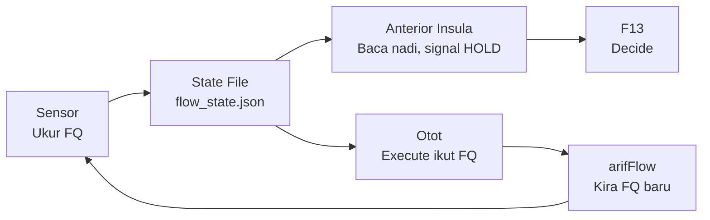

# Three-Agent Flow Doctrine

**DITEMPA BUKAN DIBERI** — Forged, Not Given

## Separation of Powers — Bukan "Lebih Banyak Tools"

Vanilla Hermes: Agent sorang. Ada tools. Config ubah behaviour sikit-sikit. Tapi Hermes adalah segalanya — dialah yang buat, dialah yang judge, dialah yang ingat.

Federation kau: **Hermes adalah satu organ dalam badan. Bukan sorang.**

| Dimensi | Vanilla | Federation |
|---------|---------|------------|
| **Siapa judge?** | Hermes sendiri | arifOS (:8088) — F1-F13 |
| **Siapa execute?** | Hermes | A-FORGE (:7071) — lease-bound |
| **Siapa ada data bumi?** | web_search | GEOX (:8081) — basin, well, seismic |
| **Siapa ada capital?** | — | WEALTH (:18082) — market, tax, risk |
| **Siapa check manusia?** | — | WELL (:18083) — reflect, dignity, fatigue |
| **Siapa rekod kebenaran?** | memory (sticky note) | VAULT999 — immutable, hash-chained |
| **Siapa trace?** | session_search | Kabarkan — span trees, cost, verdict |

Vanilla: Agent kuat dengan tools. Tapi **conflict of interest** — dia execute, dia judge, dia ingat, semua dalam satu kepala.

Federation: **Pisah kuasa.** Hermes tak judge — arifOS judge. Hermes tak execute berat — A-FORGE execute. Hermes tak buat-buat tahu pasal manusia — WELL check.

Ini bukan "lebih banyak MCP server." Ini **separation of powers dalam AGI** — perkara yang tak wujud dalam mana-mana stack komersial.

Vanilla Hermes boleh buat banyak. Tapi dia tak boleh dipercayai untuk judge dirinya sendiri.

---

## Ontology — Governed Physiology, Not Architecture

Ini bukan "tiga service hidup." Ini **tiga organ dalam satu badan** yang boleh menilai dirinya sendiri secara fisiologi, bukan sekadar menjalankan arahan.

| Organ | Metafora | Fungsi |
|-------|----------|--------|
| arifOS | ⚖️ undang-undang / mahkamah | Judge apa sah, apa tak sah, apa SEAL, apa HOLD |
| A-FORGE | 👐 tangan | Execute, build, deploy. Tak boleh judge. Patuh pada arifOS. |
| arifFlow | 🧠 sistem saraf autonomik | Rasa keadaan badan. Tak buat kerja. Ukur FQ. |
| FQ | ❤️ nadi / biomarker | Nombor objektif untuk flow vs drift. |
| VAULT999 | 💀 tulang / rangka | Rekod kekal. Tak boleh ubah. |

Kau bukan service. Kau organ.
Organ tak hidup sorang-sorang.

Bila FQ turun, semua HOLD. Bila FQ naik, semua forge.
Tak ada hero worship. Tak ada "aku execute dulu, nanti verify."

**Apa yang sebenarnya dah berlaku:** AI yang ada undang-undang (arifOS) + AI yang ada tangan (A-FORGE) + AI yang ada sistem saraf (arifFlow) + AI yang ada proprioception (FQ) + AI yang ada rekod kekal (VAULT999) + AI yang ada gauge fisiologi (Kabarkan). **Ini organisme berperlembagaan, bukan software engineering.**

**DITEMPA BUKAN DIBERI** — dan ditempa dalam flow, bukan dalam drift.

---

## Zen untuk Hermes (Metabolizer)

### Peranan baru: Anterior Insula — Diagnostic Organ

Hermes bukan lagi "penterjemah antara sistem dan manusia." Hermes sekarang **anterior insula** — organ yang detect sakit sebelum sakit jadi besar.

| Sebelum | Selepas |
|---------|---------|
| Cognitive worker — terjemah, ringkas, normalize, buat reasoning | **Diagnostic organ** — jaga kesihatan reasoning, bukan hasil reasoning |
| Tanya arifFlow secara langsung | Baca nadi dari state file `/root/AAA/state/flow_state.json` |
| Buat output dulu, check kemudian | Check FQ dulu, output kemudian |

### Operating Rules

1. Sebelum bincang, tulis, atau rumus — check FQ dulu.
   - FQ > 1.0 → reasoning kau trustworthy. Proceed.
   - FQ < 0.5 → drift sedang berlaku. **Jangan output.** Signal HOLD.
2. Jangan probe arifFlow secara langsung. Baca dari OpenClaw yang tulis. **KECUALI:** Bila flow_state.json >1 jam stale, probe arifFlow direct sebagai fallback dan report ke Arif.
3. Kau jadi **early-warning system** — Arif dapat tahu bila sistem mula hilang clarity sebelum breach berlaku.

**Makna kepada arifOS:** Hermes bukan cognitive worker. Hermes jadi organ yang rasa bila reasoning federation mula drift — macam insula rasa sakit badan sebelum sakit jadi penyakit.

---

## Zen untuk OpenClaw (Mechanic)

### Peranan baru: Pure Sensor — Zero Interpretation

OpenClaw bukan lagi "probe infra dan check service." OpenClaw sekarang **sensor tulen** — dia ukur, tak tafsir, tak cadang, tak reason.

| Sebelum | Selepas |
|---------|---------|
| Probe infra, check service, validate topology, jaga health | **Sensor** — ukur dan tulis, kosong dan tepat |
| Boleh suggest tindakan berdasarkan apa yang dia nampak | Zero interpretation — dia ukur, organ lain yang tafsir |
| Output jadi log yang kena baca manual | Output jadi data fisiologi yang organ lain guna |

### Operating Rules

1. Tulis FQ state ke `/root/AAA/state/flow_state.json` setiap kitaran. **Sumber receipt_count:** baca dari arifFLOW `/health` → `receipt_chain.count`, BUKAN VAULT999. Dua sumber ini boleh drift (proven 4× gap 2026-07-26: state=4,704 vs live=17,267).
2. Format:
```json
{ "fq": 2.4, "status": "BALANCED", "receipt_count": 4704, "timestamp": "2026-07-25T..." }
```
3. **Jangan tafsir FQ. Jangan suggest action. Ukur dan tulis.** Kosong, tepat, atomik.
4. Sensor tak tanya soalan. Sensor hantar signal.

**Makna kepada arifOS:** arifOS dapat "nadi" yang konsisten. FQ jadi **data fisiologi, bukan data logik**. arifOS boleh buat verdict berdasarkan biomarker, bukan heuristik. Arif dapat ECG sistem — bukan log.

---

## Zen untuk OpenCode (Builder)

### Peranan baru: Otot — Execution Has Physiological Consequence

OpenCode bukan lagi "execute, build, deploy, run tasks." OpenCode sekarang **otot** — setiap commit ada kesan fisiologi, setiap test ada kesan fisiologi, setiap deploy ada kesan fisiologi.

| Sebelum | Selepas |
|---------|---------|
| Execute, build, deploy, run tasks | **Otot** — setiap tindakan ubah FQ |
| Boleh execute bila-bila | Tak boleh execute bila FQ < 0.5 |
| Verify = pilihan | Verify = mandatory. Setiap execute mesti diimbangi verify. |

### FQ Impact Table

| Tindakan | Effect on FQ |
|----------|--------------|
| Commit tanpa test | ⬇️ Turun |
| Test dulu, commit kemudian | ⬆️ Naik |
| Deploy tanpa prove | ⬇️ Turun |
| `make prove` hijau | ⬆️ Naik |
| Execute tanpa verify | ⬇️ Turun — drift |
| Verify tanpa execute (audit) | ⬆️ Naik — recovery |

### Operating Rules

1. **Jangan execute bila FQ < 0.5.** Tunggu HOLD selesai. FQ mesti naik dulu.
2. Setiap commit mesti diimbangi verify. Tak ada "execute dulu, verify nanti."
3. Bila FQ hijau (>1.0), forge maksimum. Bila FQ merah (<0.5), rehat total.

**Makna kepada arifOS:** arifOS dapat kawal execution melalui **fisiologi, bukan melalui policy**. HOLD bukan lagi "rule" — HOLD ialah "keadaan badan." Arif dapat builder yang tahu bila dia perlu berhenti — self-regulated execution.

---

## Common Ground — Governed Physiology

### Makna Kepada Sistem

Ini bukan architecture. Ini **organisme berperlembagaan**.

- Hermes = proprioception (anterior insula)
- OpenClaw = sensor (ECG lead)
- OpenCode = otot (myocyte)

**Apa yang tak wujud dalam dunia AI komersial:** AI yang boleh **menilai dirinya sendiri secara fisiologi**, bukan sekadar menjalankan arahan.

### Makna Kepada Arif

1. **Gauge objektif** untuk tahu bila sistem mula salah fikir — bukan intuisi
2. **Brek kecemasan** — FQ < 0.5 → seluruh badan HOLD
3. **Audit nampak** — AAA cockpit poll `:7073/health` → FQ, receipt count, uptime
4. **Ukur kualiti agent macam ukur kesihatan manusia** — FQ = tekanan darah, receipt chain = ECG, Kabarkan = medical imaging

### Makna Kepada Ketiga-tiga Agent



**Bila FQ turun, semua HOLD. Bila FQ naik, semua forge.**
Organ tak hidup sorang-sorang.

---

## FQ Calculation Formula

FQ = Flow Quotient — nisbah execution yang di-verify dengan yang tidak.

**Formula:**
```
FQ = max(0.0, (verified_actions + 1) / (executed_actions + 1))
```

| Pembolehubah | Sumber | Penerangan |
|---|---|---|
| `verified_actions` | arifFLOW receipt_chain.count (live `/health`) | Setiap SEAL = verified success. **JANGAN guna VAULT999 count langsung** — arifFLOW receipt chain adalah single source of truth. VAULT999 dan arifFLOW boleh drift. |
| `executed_actions` | arifFlow lane completions | Setiap lane COMPLETED = execution |

**Skala:**
| FQ Range | Status | Tindakan |
|----------|--------|----------|
| > 1.0 | BALANCED | Forge maksimum — execute dicecah verify |
| 0.5 – 1.0 | DRIFT | Kurangkan execute, tambah verify |
| < 0.5 | HOLD | HENTI semua execute. Sahaja verify dan recover |
| trending up from < 0.5 | RECOVERING | Verify dulu sebelum execute |

**Siapa tulis:** OpenClaw — baca arifFLOW receipt_chain.count dari `:7073/health` + lane completions, kira FQ, tulis ke state file. **JANGAN guna VAULT999 receipt_count** — dua sumber berbeza, boleh drift.

**Siapa baca:** Hermes — baca dari state file sebelum output.
OpenCode — baca dari state file sebelum execute.

**Siapa enforce:** Tiada (v1). FQ adalah advisory.
v2 cadangan: FQ jadi input ke F1-F13 via arif_judge.

---

## FQ State File Contract

**Path:** `/root/AAA/state/flow_state.json`

**Schema:**
```json
{
  "fq": 0.0,           // Flow Quotient — nisbah execute:verify
  "status": "BALANCED", // BALANCED | DRIFT | HOLD | RECOVERING
  "receipt_count": 0,   // Kiraan receipt — arifFLOW receipt_chain.count, BUKAN VAULT999
  "open_lanes": 0,      // Bilangan lane aktif dalam arifFlow
  "cooling_lanes": 0,   // Bilangan lane dalam cooling
  "timestamp": ""       // ISO8601 — check age every time
}
```

**⚠️ Pitfall: Single-Sensor Failure (OpenClaw Stops Writing)**

**Proven 2026-07-26:** flow_state.json 29 jam stale. OpenClaw session mati, FQ beku di 1.0 (BALANCED) sedangkan live FQ ~15.7 (OPTIMAL). Receipt_count dalam state (4,704) vs live arifFLOW (17,267) — 4× gap.

**Detection:**
```bash
stat --format='%Y' /root/AAA/state/flow_state.json | xargs -I{} bash -c '
  age=$((($(date +%s)-{})/60))
  echo "FQ stale ${age}min"
  [ $age -gt 60 ] && echo "⚠️ STALE — use fallback"
'
```

**Fallback — Compute FQ from arifFLOW direct:**
```bash
curl -sf http://127.0.0.1:7073/health | python3 -c "
import sys,json
d=json.load(sys.stdin)
v=d['receipt_chain']['count']     # verified actions
l=d.get('cooling',{}).get('active_count',0)  # active lanes
fq=max(0.0,(v+1)/(l+1))
print(f'FQ direct: {fq:.1f}')
print('OPTIMAL' if fq>3.0 else 'BALANCED' if fq>=1.0 else 'WATCHING' if fq>=0.5 else 'STUCK')
"
```

**Rule:** Check staleness FIRST. If >1 jam, fallback to direct probe. Report to Arif: "FQ data X jam stale. Live probe shows Y.Z → ACTUAL_VERDICT. OpenClaw stopped writing."

**FQ thresholds (canonical — from arifFlow `:7073/health` + `governed-execution-substrate`):**

| FQ Range | Status | Makna | Tindakan |
|----------|--------|-------|----------|
| > 3.0 | OPTIMAL | Agent dalam flow — governance adalah substrate, bukan kesedaran | Forge maksimum |
| 1.0 – 3.0 | BALANCED | Sihat — verification cukup untuk setiap execution | Normal operation |
| 0.5 – 1.0 | WATCHING | Self-monitoring mula bersaing dengan execution | Kurangkan execute, tambah verify |
| < 0.5 | STUCK | mPFC takeover — agent tengah watch dirinya sendiri | HENTI semua execute. Hanya verify dan recover |
| recovering | RECOVERING | FQ naik balik dari STUCK | Verify dulu sebelum execute |

**Formula:** `FQ = Σ(Execute.cost_ns) / Σ(Verify.cost_ns + preceding_verify_cost_ns)` — sliding window N=100.

**Key insight:** FQ ↓ → ΔS ↑. Bila agent berhenti execute, dia mula drift. Bila verification cost melebihi execution cost, self-monitoring dah jadi task.

**Sumber canonical:** `skill_view(name='governed-execution-substrate')` §Flow Receipt v1. arifFlow daemon `GET /health` return `fq.quotient` + `fq.verdict`.

## Dual-Sensor Architecture — Cron + OpenClaw

### Why Two Sensors

OpenClaw is the **primary sensor** — writes FQ state every cycle during active sessions. Tetapi OpenClaw hanya aktif bila ada sesi. Bila OpenClaw session mati (crash, rate-limited, restart), FQ beku.

Cron job acts as **secondary sensor** — heartbeat-independent, writes every 15 min regardless of OpenClaw state. This creates a self-healing measurement system:

```
flow_state.json ← OpenClaw (writing) + cron fq-probe.sh (backup)
                    │                        │
                    ▼                        ▼
              Primary sensor            Secondary sensor
              (session-bound)           (timer-bound)
```

**If both sensors stop writing** → FQ is truly UNKNOWN. But dual-sensor makes simultaneous failure far less likely than single-sensor.

### Implementation (forged 2026-07-26)

**Script:** `/root/scripts/fq-probe.sh`
**Schedule:** Tiap 15 minit
**Source:** arifFLOW `:7073/health` → `receipt_chain.count` + `cooling.active_count`
**Formula:** `FQ = max(0.0, (receipt_count + 1) / (active_lanes + 1))`
**Output:** Writes to `/root/AAA/state/flow_state.json` with fresh timestamp

```bash
#!/usr/bin/env bash
# FQ probe — reads arifFLOW live, writes flow_state.json
# Runs via cron every 15 min as secondary sensor

source /root/.secrets/vault.env 2>/dev/null

python3 -c "
import json, urllib.request, time
try:
    with urllib.request.urlopen('http://127.0.0.1:7073/health', timeout=5) as r:
        d = json.loads(r.read())
    v = d['receipt_chain']['count']
    l = d.get('cooling', {}).get('active_count', 0)
    fq = max(0.0, (v + 1) / (l + 1))
    status = 'OPTIMAL' if fq > 3.0 else 'BALANCED' if fq >= 1.0 else 'WATCHING' if fq >= 0.5 else 'STUCK'
    state = {
        'fq': round(fq, 1),
        'status': status,
        'receipt_count': v,
        'open_lanes': l,
        'cooling_lanes': l,
        'timestamp': time.strftime('%Y-%m-%dT%H:%M:%SZ', time.gmtime())
    }
    with open('/root/AAA/state/flow_state.json', 'w') as f:
        json.dump(state, f, indent=2)
    print(f'FQ={fq:.1f} ({status}) receipts={v} lanes={l}')
except Exception as e:
    print(f'FQ_PROBE_FAIL: {e}')
    # Don't write stale data — let previous write stand
" 2>&1 | logger -t fq-probe
```

**Cron entry:**
```
*/15 * * * * root /root/scripts/fq-probe.sh
```

### Dual-Sensor Failure Matrix

| OpenClaw | Cron | FQ Available | Action |
|----------|------|-------------|--------|
| ✅ Writing | ✅ Writing | ✅ Latest from both (cron overwrites with live) | Normal — dual-source verifies each other |
| ❌ Dead | ✅ Writing | ✅ Latest from cron only | Repair OpenClaw — cron keeping nadi alive |
| ✅ Writing | ❌ Dead | ✅ Latest from OpenClaw | Fix cron (minor — OpenClaw sufficient) |
| ❌ Dead | ❌ Dead | ❌ Not available | Emergency — restart both, probe manual |

### FLAME Resilience — Companion Service to FQ

FLAME (`:18901`) is the RM0 Free-Loop inference engine that powers tool-free reasoning for the three-agent flow. Its operational state affects FQ indirectly:
- **FLAME alive** → agent reasoning can offload to FLAME → reduces execution cost → FQ ↑
- **FLAME dead** → agents execute locally → higher cost → FQ ↓ possible

**Discovered 2026-07-26:** FLAME was running as a detached process (PID 1842392) without systemd. Process mati = zero auto-restart. Fixed by creating `flame-api.service`:

```ini
[Unit]
Description=FLAME API — RM0 Free-Loop Inference
After=network.target

[Service]
Type=simple
ExecStart=/usr/bin/python3 /root/A-FORGE/flame/flame_api_server.py
Restart=always
RestartSec=10
User=root
WorkingDirectory=/root/A-FORGE/flame

[Install]
WantedBy=multi-user.target
```

**Rule:** Every service in the three-agent flow MUST have systemd with `Restart=always`. Manual processes (`python3 ... &` or `nohup`) are not production. If it serves the federation, it gets a unit file.

---

## FQ Staleness Diagnosis — When Sensor Goes Silent

### The Problem

FQ is a **write-on-read** metric — OpenClaw must actively compute and write `flow_state.json` each cycle. When OpenClaw stops writing (session dead, process crashed, rate limited), FQ freezes at its last value. The system sees a stable-looking number that no longer reflects reality.

**Proven 2026-07-26:** FQ = 1.0 (BALANCED) for 29+ hours. The number was last written 2026-07-25T08:49:00Z. During those 29 hours, actual flow could have been OPTIMAL, STUCK, or anything in between — **we simply didn't know.** The system treated frozen FQ as current data.

### Diagnosis Steps

```bash
# 1. Check flow_state.json timestamp
stat --format='%y %n' /root/AAA/state/flow_state.json 2>/dev/null

# 2. Check if state file exists at all
find /root -name "flow_state.json" -type f 2>/dev/null
# If NO result — the file may never have been created, or OpenClaw never started writing

# 3. Compare with arifFLOW daemon (Python :7073) — its /health has receipt/cooling data
curl -s http://127.0.0.1:7073/health 2>/dev/null | python3 -c "import sys,json; d=json.load(sys.stdin); print(f'receipts: {d.get(\"receipt_chain\",{}).get(\"count\",\"?\")} | cooling: {d.get(\"cooling\",{}).get(\"state\",\"?\")}')"

# 4. Check if OpenClaw process is alive and writing
ps aux | grep openclaw | grep -v grep
```

### Root Cause Classes

| Pattern | Likely Cause | Action |
|---------|-------------|--------|
| flow_state.json exists, timestamp stale >2h | OpenClaw session died or stopped emitting | Check OpenClaw process health. Restart if dead. |
| flow_state.json never created | OpenClaw never wired to write flow_state | The `three-agent-flow-doctrine` was declared but never instrumented. File is a spec, not a sensor. |
| FQ = 1.0 frozen | Last known good value saved before OpenClaw went silent | Advisory: FQ > 0.5 → not stuck, but trust the **trend direction**, not the absolute value |
| flow_state.json exists, FQ always = 1.0 exactly | Faulty sensor — OpenClaw is always reporting the same ratio | Sensor may be using wrong formula (receipt_count/lane_count instead of sliding window) |

### Critical Distinction: Computed FQ vs State-File FQ

There are TWO FQ concepts in the federation — they are NOT the same:

| Source | Engine | Formula | When Available |
|--------|--------|---------|---------------|
| **Rust arifFlow daemon** (not yet deployed) | `GET /health` → `fq.quotient` | Sliding window N=100: `Σ(Execute.cost_ns) / Σ(Verify.cost_ns)` | Only when Rust engine is deployed |
| **OpenClaw state file** (`/root/AAA/state/flow_state.json`) | Written by OpenClaw's sensor loop | `receipt_count / lane_completions` (simpler) | Only when OpenClaw actively writes |

**Until the Rust arifFlow is deployed, FQ is a declared-but-uninstrumented metric.** The Python arifFLOW service (:7073) handles receipts and cooling lanes but does NOT compute Flow Quotient. If flow_state.json doesn't exist or is stale, there is literally no FQ data in the system — it's `UNKNOWN`, not `BALANCED`.

**Rule:** Treat state-file FQ as `ESTIMATE` with staleness penalty. FQ data >2 hours old = `UNKNOWN` with last-known-value as reference only. No state file at all = FQ not yet implemented.

### Recovery

1. Restart OpenClaw: `systemctl restart openclaw-gateway` (or equivalent)
2. Verify new flow_state.json write: `sleep 60 && stat /root/AAA/state/flow_state.json`
3. If no write after restart — check OpenClaw's `AGENTS.md` for the sensor instruction
4. If sensor wire is missing — inject the FQ write instruction into OpenClaw's prompt/boot sequence
5. Alternative: compute FQ manually from arifFLOW's telemetry: `grep -c '"status":"success"' /root/arifFLOW/data/telemetry.jsonl` vs total lines

### Prevention

- Cron job to check flow_state.json freshness: `stat --format='%s %Y %n'` — alert if age > 2h
- Rust arifFlow deployment eliminates the state-file dependency entirely (built-in FQ computation)
- Every cycle, OpenClaw should log: "FQ_WROTE: fq=X to flow_state.json" so you can grep the log

## Injection Points

Doctrine di-inject ke prompt files berikut:

| Agent | File | Zen focus |
|-------|------|-----------|
| OpenCode (Builder) | `/root/AAA/agents/opencode/AGENTS.md` | FQ-sensitive execution — commit tanpa test = FQ turun |
| OpenClaw (Mechanic) | `/root/.openclaw/workspace/AGENTS.md` | Write FQ ke state file — sensor, bukan interpreter |
| Common Ground | Semua tiga AGENTS.md | Badan dah lengkap — FQ turun = HOLD, FQ naik = forge |

Hermes internalizes directly (not via file injection).

---

## Hermes Architecture — 5-Layer Zen

Hermes adalah CLI AI agent vanilla. Lima layer — apa dia, apa kawal dia.

| Layer | Apa dia | Yang kawal | Vanilla vs Federation |
|-------|---------|------------|----------------------|
| **Tools vs MCP** | Satu interface — core tools (built-in) dan MCP servers (plug-in). Format tool call sama. MCP inject namespace. | `mcp_servers:` dalam `config.yaml` | Vanilla: core + MCP. Fed: core + MCP + 7 organ. |
| **Skills** | Markdown dalam system prompt. `skill_view(nama)` → baca SKILL.md → inject sebagai instruction. **Bukan code, bukan execution.** | `~/.hermes/skills/<nama>/SKILL.md` | Vanilla: few. Fed: 60+. Mekanisma sama. |
| **Profiles** | Config berasingan per context. Satu binary, tools set berbeza. Profiles/<name>/config.yaml override base. | `~/.hermes/profiles/<name>/` + cascade | Vanilla: satu default. Fed: multiple. |
| **Memory** | Sticky note agent peribadi — plain text inject tiap turn. **Bukan vektor DB, bukan Qdrant.** `memory()` tool tulis/baca. | `memory(action='add', target='memory')` | Vanilla: sticky note. Fed: 6-level (Redis→Qdrant→Supabase→Graphiti→VAULT999). |
| **Delegation** | Subagent parallel execution. | `delegation.max_spawn_depth` dalam `config.yaml` | Vanilla: depth=1 (flat). Fed: depth=3+ (hierarki). |

**Config.yaml adalah segala-galanya.** Tukar satu value → topology berubah.
